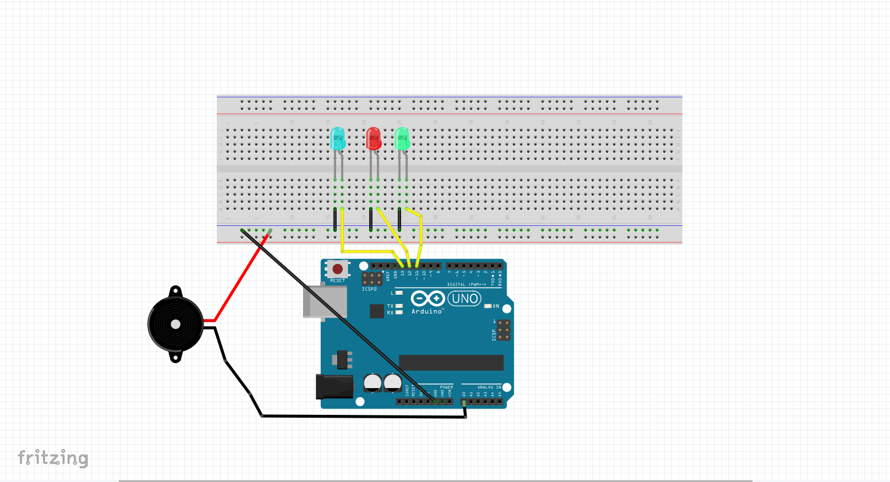

# Cloud Doorbell

The Android Things Doorbell sample demonstrates how to create a “smart” doorbell.
The sample captures a button press from a user, obtains an image via a camera peripheral,
processes the image data using Google’s Cloud Vision API, and uploads the image, Cloud Vision
annotations and metadata to a Firebase database where it can be viewed by a companion app.

## Screenshots

[(Watch the demo on YouTube)][demo-yt]

## Schematics

## Pre-requisites

- Android Things compatible board
- Arduino Uno board
- Android Studio 2.2+
- Android smartphone
- Firebase project with Database and Storage
- The following individual components:
    - 1 loudity sensor
	- 3 LED lights
    - jumper wires
    - 1 breadboard

## Setup and Build

To setup, follow these steps below.

1. Create the app in Android Studio

2.  Add a valid `google-services.json` from Firebase to `app/` and
    `companionApp/`
  - Create a Firebase project on [Firebase Console](https://console.firebase.google.com)
  - Add an Android app with your specific package name in the project
  - Download the auto-generated `google-services.json` and save to `app/` and `companionApp/` folders

3.  Ensure the security rules for your Firebase project allow public read/write
    access. **Note:** The rules in this section are set to public read/write for
    demonstration purposes only.
  - Firebase -> Database -> Rules:

          {
            "rules": {
              ".read": true,
              ".write": true
            }
          }

4. Create an Arduino project
	- Reads data from the loudity sensor and sends it to the 115200 port
	- Reads a character from the 115200 port ('R', 'G', 'B') and lights the appropriate LED

There are two modules: `app` and `companionApp`, the former is on device while the latter on
companion device e.g. Android phone.

## Running

To run the `app` module on an Android Things board:

1. Connect the LEDs and loudity sensor to the Arduino board
2. Connect the Arduino board to the Raspberry Pi, using the port USB1-1.2:1.0
3. Deploy and run the `app` module of the Android Things app
4. Deploy and run the `app` module of the Android app 
5. Verify from Firebase Console that pictures are uploaded to a log in the Firebase database
   of your project
6. Verify list in the app
